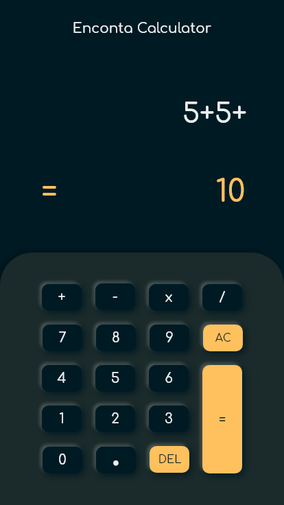

# Calculator in React

## App running in [Netlify](https://encontacalculator.netlify.app/)

### Installation and Setup Instructions

- Clone this repository. 
- Check in your machine, `node` and `npm` installed globally. 
- Installation:
    `npm install` or `npm i`
- For run unit test: 
    `npm test`
- Run in local Server:
    `npm start`

